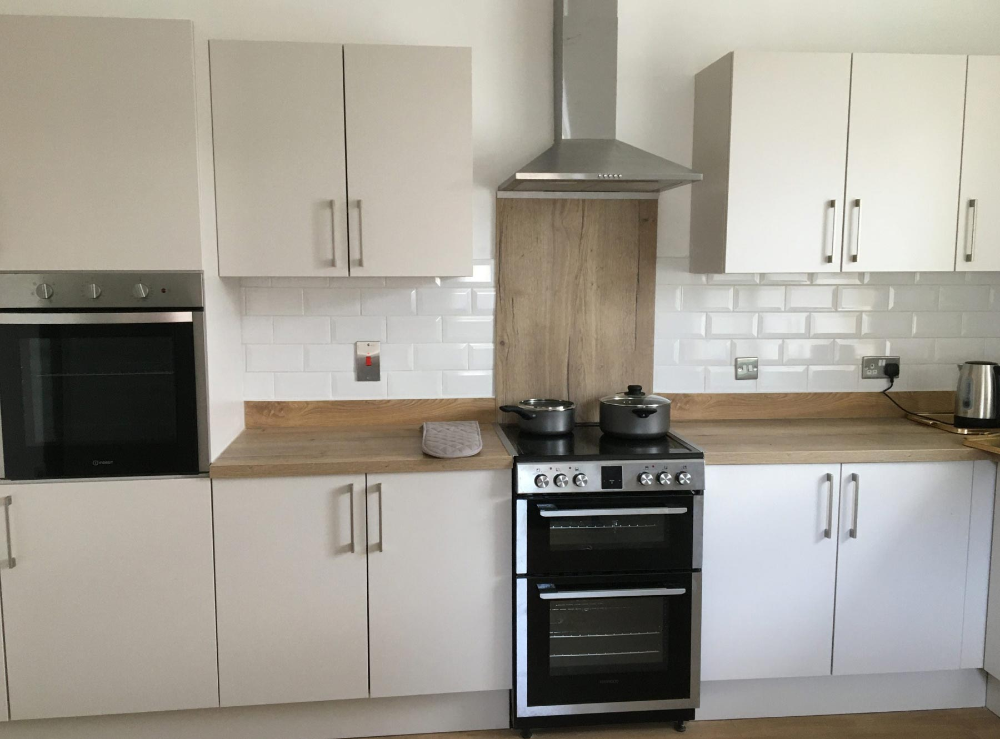

	
  
	  	

			<h2><strong>Hiring Walbottle Village Institute</strong></h2>
			  
Walbottle Village Institute is available to hire. Detail about the hall and it's facilities are listed below. Please read over the hire agreement and safeguarding policies, and if you would like to book the institute please use the form on the <a href="contact_wvi.html" title="visit the WVI contact page" target="_self"><strong>contact page</strong></a>.

		
   
	  	

			<a href="wvi_hire.html" title="hire the institute hall" target="_self" class="hire" accesskey="h">Hire The Hall</a>
		
  
	
 
	

		

			

				

					

						

							
						

						

							<h3><strong>Walbottle Village Institute</strong></h3>
							
<strong>The hall has recently been refurbished and is able to accommodate 50 people making it an ideal place for your party or event.</strong>

							
The institute is an accessible building with a disabled toilet and baby change facilities. It has a Generously proportioned kitchen and a large main hall. It also has WiFi so is great for your party playlist. Hire charges are <strong>&pound;10 an hour</strong>. Click the images to enlarge.

						

					

				

			

			

				

					

						

							
						

						

							
						

						

							<h3><strong>The Hall</strong></h3>
							
<strong>Facilities include:</strong>

							<ul>
								<li>WiFi</li>
								<li>Projector and screen</li>
								<li>Cenral heating</li>
								<li>Tables available (enquire for quantity)</li>
								<li>Chairs available (enquire for quantity)</li>
								<li>On-street parking directly outside the institute</li>
							</ul>
						

					

				

				

					

						

							
						

						

							
						

						

						

					

				

			

			

				

					

						

							
						

						

							<h3><strong>Kitchen</strong></h3>
							
<strong>Facilities include:</strong>

							<ul>
								<li>Electric oven with grill and four ring hob</li>
								<li>Second electric oven</li>
								<li>Fridge</li>
								<li>Microwave</li>
								<li>Sink</li>
								<li>Cutlery and dining sets (enquire for quantity)</li>
								<li>Cooking utensils</li>
							</ul>
						

					

				

			

			

				

					

						

							
						

						

							<h3><strong>Toilet and Wash Room</strong></h3>
							
<strong>Facilities include:</strong>

							<ul>
								<li>Accessible toilet facilities</li>
								<li>Sink</li>
								<li>Hand dryer</li>
								<li>Baby change facilities</li>
							</ul>
						

					

				

			

		

		

			

			<h3><strong>Documents:</strong></h3>
			<ul>
			<li><a href="../assets/pdf/WVI_Hire_Agreement.pdf" title="view the Hire Agreement PDF in a new window" target="_blank">Hire Agreement PDF</a></li>
			<li><a href="../assets/pdf/WVI_Safeguarding_Policy.pdf" title="view the Safeguarding Policy PDF in a new window" target="_blank">Safeguarding Policy PDF</a></li>
			</ul>
			

		
 
	

 <!-- /container -->
