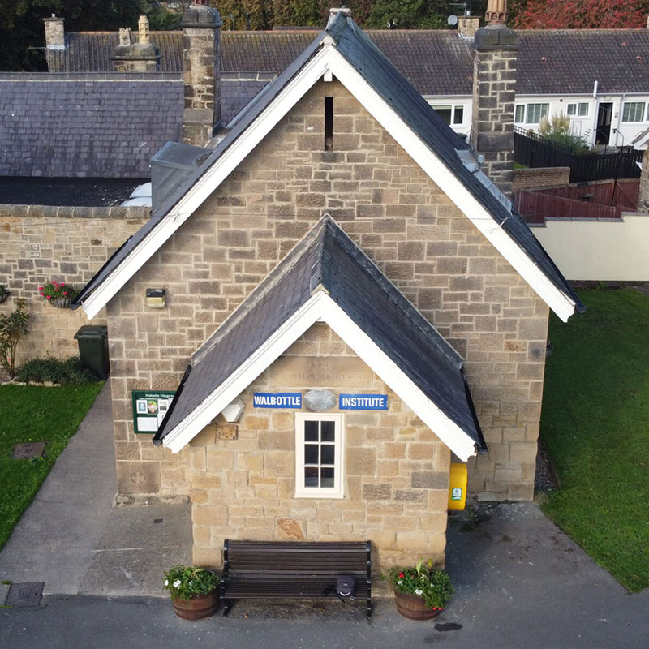
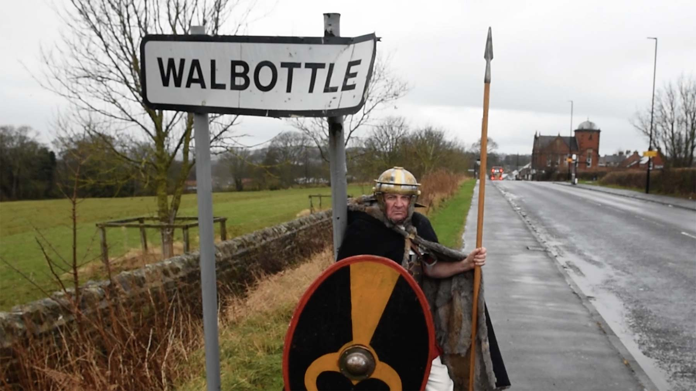

	
  
	  	

			<h2><strong>News From Walbottle Village Institute</strong></h2>
			  
Latest news from the Village Institute. If you would like to contribute an article please get in touch using the details on our contact page.  

		
   
	  	

			<a href="../wvi_hire/" title="hire the institute hall" target="_self" class="hire" accesskey="h">Hire The Hall</a>
		
  
	
 
	

		

			

				

					

						

							
						

						

							<h3><strong>Invitation of Expressions of Interest to Become A Trustee of Walbottle Village Institute Charity</strong></h3>
							
Published: 16th December 2024

    
The Trustees of Walbottle Village Institute invite expressions of interest from Walbottle Residents to become additional Trustees of the Walbottle Village Institute Charity.

Trustees are the volunteers who lead charities and decide how they are run.

They have independent control over and legal responsibility for a charity’s management and administration.

The role is unpaid; Trustees meet once every 2-3 months usually on a Wednesday Evening locally.

							
<strong>To be eligible, you must be:</strong>

							<ul>
								<li>At least 18 years of age</li>
								<li>You must not be disqualified by the Charities Commission from holding such a role.</li>
								<li>Further information regarding the role of a Trustee can be found at: 
<a href="www.gov.uk/guidance/charity-trustee-whats-involved" title="view link in a new tab" target="_blank">https://www.gov.uk/guidance/charity-trustee-whats-involved</a></li>
							</ul>
							
If you would like further information, please contact Wendy Carr (Secretary WVI Trustees) by email at: <a href="mailto:wendy@walbottlevi.com" title="email Wendy Carr">wendy@walbottlevi.com</a>

						

					

				

			

			

				

					

						

							
						

						

							<h3><strong>AGM 17 th of July at 7.30 pm </strong></h3>
							
Published: 12th June 2024

    
<strong>Agenda Preview</strong> We will send a detailed agenda closer to the date. In the meantime, we wanted to give you advance notice of a critical discussion point: proposed renovation work. The key tasks include:

    <ul>
        <li><strong>Addressing Damp Issues in the Porch:</strong> This involves dry lining the entryway.</li>
        <li><strong>Repairing Wall Cracks:</strong> Essential maintenance to ensure structural integrity.</li>
        <li><strong>Redecorating the Building:</strong> A fresh look for our entire facility.</li>
        <li><strong>Electrical Work:</strong> Some of which we will manage, while other tasks will be conducted by the electric board, potentially requiring external pathway excavation. Unfortunately, we may have limited notice for these external works.</li>
    </ul>
    
<strong>Minimising Disruption</strong> We aim to minimize any disruption and ensure safety for all. The contractor overseeing the renovations will be present at the meeting to address any questions or concerns you may have.

    
<strong>Your Input Needed</strong> We also seek your suggestions for paint colors for the hall. Should we maintain the current scheme or opt for a change? Your input is valuable to us.

    
We look forward to your participation and to a productive discussion, see you on 17 2024 th of July at 7.30 pm .
						

					

				

			

			

				

					

						

							
						

						

							<h3><strong>Designated Place Of Safety</strong></h3>
							
Published: 31 March 2024

							
<strong>We have had a planned visit from a representative of the council to formalise that Walbottle Village Institute will be used as a Designated Place of Safety in the event of evacuation if a major emergency situation develops.</strong>

							
This reinforces that the Volunteers who make up the Board of Trustees of the Institute are committed to the safety and well-being of every resident of Walbottle and surrounding areas. Upholding this commitment requires planning and practice to respond to an emergency affecting the Village. The need for this formality and a designated place of safety was brought to our attention during the wildfires of 2022. The WVI will act as a warm place where support and help will be available for all. It will also be a communication and coordination centre for the Emergency Services.

							
The goals of the Board of Trustees of Walbottle Village Institute in responding to an emergency include:

							<ul>
								<li>The safety of all Residents of Walbottle Village and surrounding areas</li>
								<li>The physical and emotional well-being of all residents of Walbottle Village and surrounding areas.</li>
								<li>To provide a communication hub for Emergency Services</li>
								<li>To aid the timely stabilization of an emergency situation</li>
							</ul>
						

					

				

			

			

				

					

						

							
						

						

							<h3><strong>Gannin Alang The Wall – A Film About The True Route Of Hadrian’s Wall Through Newcastle</strong></h3>
							
Published: 12 August 2022

							
<strong>On the 10th of September to celebrate Hadrian’s Wall 1900 we are planning to have a public showing of the film “Gannin’ alang the Wall” (in which Walbottle is featured) in the Village Institute.</strong>

							
There will also be quiche, salad and refreshments. We hope to be able to get the film’s creator, Judith Green (seen on Countryfile 7th August) to explain why the film was made and have also invited John Sadler BA(Hons) M.Phil, FRHistS, FSA as guest speaker to place Hadrian’s Wall in context.

							
Doors open at 6:30pm with a start at 7pm and finish about 9:30pm. Numbers are limited to about 50 and will be on a first come first served basis. There is no charge for the evening but donations would be gratefully received and will go towards future events.

						

					

				

			

			

				

					

						

							
						

						

							<h3><strong>Projector &amp; Screen</strong></h3>
							
Published: 24 February 2022

							
<strong>Very many thanks to Blaydon Communications Ltd (www.blaydoncomms.co.uk) who have kindly donated a projector and screen to the Walbottle Village Institute.</strong>

							
We will now be able to show films in the Institute during our Pie &amp; Pea nights to raise funds for the Walbottle Festival 2022. <strong>Lets #Celebrate2022.</strong>

						

					

				

			

		

		

			

			<h3><strong>News Headlines:</strong></h3>
			<ul>
			<li><a href="#trustees" title="view 'Trustees' article">Expressions of Interest to Become A Trustee</a> Published: 16 December 2024</li>
			<li><a href="#AGM" title="view 'AGM' article">AGM 2024</a> Published: 12 June 2024</li>
			<li><a href="#safety" title="view 'Designated Place Of Safety' article">Designated Place Of Safety</a> Published: 31 March 2024</li>
			<li><a href="#pie_peas" title="view 'Pie &amp; Peas Supper and Film Night' article">Pie &amp; Peas Supper and Film Night</a> Published: 19 February 2024</li>
			<li><a href="#gannin" title="view 'Gannin Alang The Wall' article">Gannin Alang The Wall – A Film About The True Route Of Hadrian’s Wall Through Newcastle</a> Published: 12 August 2022</li>
			<li><a href="#gannin" title="view 'Projector &amp; Screen' article">Projector &amp; Screen</a> Published: 24 February 2022</li>
			</ul>
			

		
 
	

 <!-- /container -->
