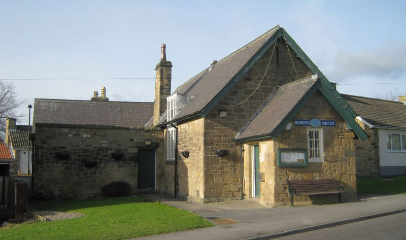

	
  
	  	

			<h2><strong>News From Walbottle Village Institute</strong></h2>
			  
Latest news from the Village Institute. If you would like to contribute an article please get in touch using the details on our contact page.  

		
   
	  	

			<a href="wvi_hire.html" title="hire the institute hall" target="_self" class="hire" accesskey="h">Hire The Hall</a>
		
  
	
 
	

		

			

				

					

						

							
						

						

							<h3><strong>Designated Place Of Safety</strong></h3>
							
Published: 31 March 2024

							
<strong>We have had a planned visit from a representative of the council to formalise that Walbottle Village Institute will be used as a Designated Place of Safety in the event of evacuation if a major emergency situation develops.</strong>

							
This reinforces that the Volunteers who make up the Board of Trustees of the Institute are committed to the safety and well-being of every resident of Walbottle and surrounding areas. Upholding this commitment requires planning and practice to respond to an emergency affecting the Village. The need for this formality and a designated place of safety was brought to our attention during the wildfires of 2022. The WVI will act as a warm place where support and help will be available for all. It will also be a communication and coordination centre for the Emergency Services.

							
The goals of the Board of Trustees of Walbottle Village Institute in responding to an emergency include:

							<ul>
								<li>The safety of all Residents of Walbottle Village and surrounding areas</li>
								<li>The physical and emotional well-being of all residents of Walbottle Village and surrounding areas.</li>
								<li>To provide a communication hub for Emergency Services</li>
								<li>To aid the timely stabilization of an emergency situation</li>
							</ul>
						

					

				

			

			

				

					

						

							
						

						

							<h3><strong>WVI And Warm Space Initiative</strong></h3>
								
Published: 10 November 2022

								
<strong>The Board of Trustees of Walbottle Village Institute are considering opening the Institute as a Warm Space for use by the village residents.</strong>

								
This may be combined with offering a light lunch served free of charge to those who are finding it difficult to cope with the increase in heating and other living costs. However, to be able to offer this service they are in need of volunteers. If you can offer a morning once a week to help your neighbours it would be greatly appreciated.

								
Please get in touch using the <a href="contact_wvi.html" title="contact Walbottle Village Institute" target="_self">contact page</a>.

						

					

				

			

			

				

					

						

							
						

						

							<h3><strong>Gannin Alang The Wall – A Film About The True Route Of Hadrian’s Wall Through Newcastle</strong></h3>
							
Published: 12 August 2022

							
<strong>On the 10th of September to celebrate Hadrian’s Wall 1900 we are planning to have a public showing of the film “Gannin’ alang the Wall” (in which Walbottle is featured) in the Village Institute.</strong>

							
There will also be quiche, salad and refreshments. We hope to be able to get the film’s creator, Judith Green (seen on Countryfile 7th August) to explain why the film was made and have also invited John Sadler BA(Hons) M.Phil, FRHistS, FSA as guest speaker to place Hadrian’s Wall in context.

							
Doors open at 6:30pm with a start at 7pm and finish about 9:30pm. Numbers are limited to about 50 and will be on a first come first served basis. There is no charge for the evening but donations would be gratefully received and will go towards future events.

						

					

				

			

			

				

					

						

							
						

						

							<h3><strong>Projector &amp; Screen</strong></h3>
							
Published: 24 February 2022

							
<strong>Very many thanks to Blaydon Communications Ltd (www.blaydoncomms.co.uk) who have kindly donated a projector and screen to the Walbottle Village Institute.</strong>

							
We will now be able to show films in the Institute during our Pie &amp; Pea nights to raise funds for the Walbottle Festival 2022. <strong>Lets #Celebrate2022.</strong>

						

					

				

			

		

		

			

			<h3><strong>News Headlines:</strong></h3>
			<ul>
			<li><a href="#safety" title="view 'Designated Place Of Safety' article">Designated Place Of Safety</a> Published: 31 March 2024</li>
			<li><a href="#pie_peas" title="view 'Pie &amp; Peas Supper and Film Night' article">Pie &amp; Peas Supper and Film Night</a> Published: 19 February 2024</li>
			<li><a href="#warm" title="view 'WVI And Warm Space Initiative' article">WVI And Warm Space Initiative</a> Published: 10 November 2022</li>
			<li><a href="#gannin" title="view 'Gannin Alang The Wall' article">Gannin Alang The Wall – A Film About The True Route Of Hadrian’s Wall Through Newcastle</a> Published: 12 August 2022</li>
			<li><a href="#gannin" title="view 'Projector &amp; Screen' article">Projector &amp; Screen</a> Published: 24 February 2022</li>
			</ul>
			

		
 
	

 <!-- /container -->
